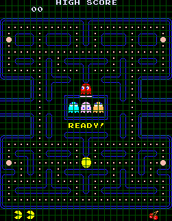

#### About The Game

###### Goal Of The Game:

The player(Pacman) is placed in a maze filled with food (depicted as pellets or dots) and needs to eat all of it to advance to the next level.

Four ghosts pursue Pac-Man through the maze. If Pac-Man makes contact with any of the ghosts, the player loses a life and the positions of Pac-Man and the ghosts are reset back to their starting locations, though any dots that were eaten remain so.

Other than simply avoiding them, Pac-Man's only defense against the ghosts are the four larger "energizer" pellets located at the corners of the maze. Eating one causes the ghosts to become frightened and retreat for a short time, and in the early levels of the game Pac-Man can even eat the ghosts for bonus points during this period.

An eaten ghost is not completely eliminated, but is returned to its starting position before resuming its pursuit. Other than eating dots and ghosts, the only other source of points are the two pieces of fruit which appear during each level near the middle of the maze. The first fruit appears when Pac-Man has eaten 70 of the dots in the maze, and the second when 170 have been eaten.

###### Levels:

Every level of Pac-Man uses the same maze layout, containing 240 regular "food" dots and 4 energizers.

The tunnels that lead off of the left and right edges of the screen act as shortcuts to the opposite side of the screen, and are usable by both Pac-Man and the ghosts, though the ghosts' speed is greatly reduced while they are in the tunnel.

Even though the layout is always the same, the levels become increasingly difficult due to modifications to Pac-Man's speed, as well as changes to both the speed and behavior of the ghosts.

After reaching level 21, no further changes to the game's mechanics are made, and every level from 21 onwards is effectively identical.

###### Elements Of Ghost Behaviour:

Each of the ghosts is programmed with an individual "personality", a different algorithm is used to determine its method of moving through the maze.

* The Ghost House:

When a player begins a game of Pac-Man, they are not immediately attacked by all four of the ghosts. As shown on the diagram of the initial game position, only one ghost begins in the actual maze, while the others are inside a small area in the middle of the maze, often referred to as the "ghost house".

Other than at the beginning of a level, the ghosts will only return to this area if they are eaten by an energized Pac-Man, or as a result of their positions being reset when Pac-Man dies.

The ghost house is otherwise inaccessible, and is not a valid area for Pac-Man or the ghosts to move into. Ghosts always move to the left as soon as they leave the ghost house, but they may reverse direction almost immediately due to an effect that will be described later.

* Target Tiles:

Much of Pac-Man's design and mechanics revolve around the idea of the board being split into tiles. "Tile" in this context refers to an 8 x 8 pixel square on the screen. Pac-Man's screen resolution is 224 x 288, so this gives us a total board size of 28 x 36 tiles, though most of these are not accessible to Pac-Man or the ghosts.

As an example of the impact of tiles, a ghost is considered to have caught Pac-Man when it occupies the same tile as him. In addition, every pellet in the maze is in the center of its own tile. It should be noted that since the sprites for Pac-Man and the ghosts are larger than one tile in size, they are never completely contained in a single tile.

Due to this, for the game's purposes, the character is considered to occupy whichever tile contains its center point. This is important knowledge when avoiding ghosts, since Pac-Man will only be caught if a ghost manages to move its center point into the same tile as Pac-Man's.

The ghosts are almost always motivated by trying to reach a particular tile.

* Ghost Movement Modes

TODO()