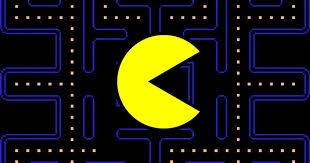

# A Very Basic Pacman Game Tutorial in C language

#### 1st step - Design the game structure

Identify the main components of the game, such as Pacman, ghosts, pellets and the maze



#### 2nd step - Designing the Game Board
I choosed to read the game board from a text file, but you can also build the game board differently.
```c
#include <stdio.h>

#define ROWS 10
#define COLS 20

// Function to initialize the game board from file
void initialize_board_from_file(char board[ROWS][COLS], const char* filename) {
    FILE* file = fopen(filename, "r");
    if(file == null) {
        printf("Error opening file: %s\n", filename);
        exit(1);
    }

    for (int i = 0; i < ROWS; i++) {
        for(int j = 0; j < COLS; j++) {
            fscanf(file, " %c", &board[i][j]);
        }
    }
    fclose(file);
}

// Function to print the game board
void print_Board(char board[ROWS][COLS]) {
    for(int i = 0; i < ROWS; i++) {
        for(int j = 0; j < COLS; j++) {
            printf("%c", board[i][j]);
        }
        printf("\n");
    }
}

int main() {
    // Declare and initialize the game board from a file
    char game_board[ROWS][COLS];
    initializeBoardFromFile(game_board, "maze.txt");

    //print the initial game board
    print_board(game_board);

    return 0;
}
```
#### 3rd step - Define Game Entities

``` c
// Example structure for Pacman
struct Pacman {
    int x, y; // current position
    int lives; // Number of lives
    int score; // Player's score
}

// Example structure for Ghost
struct Ghost {
    int x, y; // current position
    // Add more properties as needed
}

// Example structure for Pellet
struct Pellet {
    int x, y; // current position
    // Add more properties as needed
}

struct MagicPellet {
    int x, y;
    // Add more properties as needed
}

struct Maze {
    // define the maze layout, walls, etc
}
```

#### 4th step - Handle User Input and Move Pacman

``` c
char get_input() {
    return getc(stdin);
}

int is_valid_move(char board[ROWS][COLS], int x, int y) {
    return (x >= 0 && x < ROWS && y >= 0 && y < COLS && board[x][y] != '#');
}

void move_pacman(char board[ROWS][COLS], struct Pacman* pacman, char input) {
    int newX = pacman->x;
    int newY = pacman->y;

    switch (input) {
        case 'w': // Move up
            newX--;
            break;
        case 's': // Move down
            newX++;
            break;
        case 'a': // Move left
            newY--;
            break;
        case 'd': // Move right
            newY++;
            break;
        // Add more cases for other keys if needed
    }
    if(is_valid_move(board, newX, newY)) {
        // Clear the current position on the board
        board[pacman->x][pacman->y] = ' ';
        // Update Pacman's position
        pacman->x = newX;
        pacman->y = newY;
        // Place Pacman in the new position on the board
        board[pacman->x][pacman->y] = 'P';
    }
}

```

#### 5th step - Update Game State